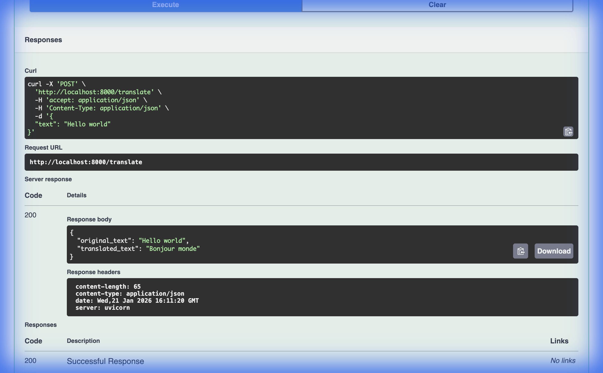

# Language Translation API

A robust FastAPI microservice that translates English text to French using the `Helsinki-NLP/opus-mt-en-fr` Transformer model. Dockerized for easy deployment.



## Features
- 🚀 **FastAPI**: High-performance, easy-to-use web framework.
- 🐳 **Dockerized**: specific `Dockerfile` and `docker-compose` setup for containerization.
- 🤖 **Transformers**: Uses State-of-the-art HuggingFace models.
- 📄 **Swagger UI**: Interactive API documentation.

## Quick Start (No Docker)

For local testing, we provide a helper script to get you up and running instantly.

1. **Install Dependencies**
   ```bash
   pip install -r requirements.txt
   ```

2. **Run the App**
   ```bash
   ./start.sh
   ```
   The server will start at `http://localhost:8000`.

3. **Test It**
   - **Visual Interface**: Go to [http://localhost:8000/docs](http://localhost:8000/docs).
   - **Command Line**: Run the test script:
     ```bash
     python3 test_request.py
     ```

## Running with Docker

1. **Build and Start**
   ```bash
   docker-compose up --build
   ```

2. **Access**
   The service will be available on port 8000.

## API Usage

### Endpoint: `POST /translate`

**Request Body:**
```json
{
  "text": "Hello world"
}
```

**Response:**
```json
{
  "original_text": "Hello world",
  "translated_text": "Bonjour monde"
}
```

> **Note:** If you visit `/translate` in your browser, you will see a helpful message. You must use a POST request (via Swagger UI, curl, or Python) to get a translation.

## Project Structure
- `app/`: Source code for the application.
- `assets/`: Images and static resources.
- `start.sh`: Standard local launch script.
- `test_request.py`: Simple Python client for testing.
